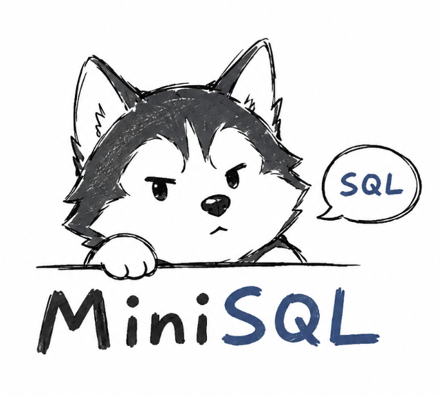

<p align="center">
  
</p>

<h1 align="center">MiniSQL</h1>

<p align="center">
  
  
  
  
  
</p>

MiniSQL 是一个轻量级 C++23 微型关系型数据库管理系统，对标 MySQL 的基础交互方式。命令中的 `mysql` 名称在本项目中统一替换为 `minisql`。

项目实现了任务书要求的基本能力：文件系统持久化、C/S 架构、TCP/IP 通信、DDL、DML、主键索引、交互式 CLI、CMake 构建和单元测试。代码未使用 STL 标准容器，内部提供了简单的 `Array<T>` 动态数组。

## 功能

- C/S 架构：`minisqld` 服务端，`minisql` 客户端
- TCP/IP 协议：默认 `127.0.0.1:3307`
- 数据库存储：每个数据库一个目录，每张表一个 `.dat` 文件，主键表生成 `.idx`
- 支持类型：`int`、`string`，字符串最长 256 字符，UTF-8
- 支持语句：
  - `create database <dbname>`
  - `drop database <dbname>`
  - `use <dbname>`
  - `create table <table> (<column> <type> [primary], ...)`
  - `drop table <table>`
  - `insert <table> values (<value>, ...)`
  - `select <column|*> from <table> [where <column> <op> <value>]`
  - `delete <table> [where <column> <op> <value>]`
  - `update <table> set <column> = <value> [where <column> <op> <value>]`
  - `show databases`
  - `show tables`
  - `exit`

`where` 中的 `<op>` 支持 `=`、`<`、`>`。

## 一键安装

支持 Linux 和 macOS。安装前需要准备 `git`、`cmake` 和支持 C++23 的编译器。

Linux 可使用发行版包管理器安装依赖，例如 Ubuntu/Debian：

```bash
sudo apt update
sudo apt install -y git cmake g++
```

macOS 可使用 Xcode Command Line Tools 和 Homebrew 安装依赖：

```bash
xcode-select --install
brew install cmake
```

通过 curl 下载安装脚本并从 Git 仓库构建安装：

```bash
curl -fsSL https://raw.githubusercontent.com/kiritosuki/MiniSQL/main/scripts/install.sh \
  | bash -s -- --repo https://github.com/kiritosuki/MiniSQL.git --prefix "$HOME/.local"
```

安装后确保 `$HOME/.local/bin` 在 `PATH` 中：

```bash
export PATH="$HOME/.local/bin:$PATH"
```

如果需要安装到系统目录：

```bash
curl -fsSL https://raw.githubusercontent.com/kiritosuki/MiniSQL/main/scripts/install.sh \
  | sudo bash -s -- --repo https://github.com/kiritosuki/MiniSQL.git --prefix /usr/local
```

## 从源码编译安装

Linux 和 macOS 均可使用源码编译安装：

```bash
git clone https://github.com/kiritosuki/MiniSQL.git
cd MiniSQL
cmake -S . -B build -DCMAKE_BUILD_TYPE=Release -DCMAKE_INSTALL_PREFIX="$HOME/.local"
cmake --build build -j"$(nproc 2>/dev/null || getconf _NPROCESSORS_ONLN 2>/dev/null || sysctl -n hw.ncpu)"
cmake --install build
```

不安装也可以直接运行 `build/minisqld` 和 `build/minisql`。

## 使用方式

先启动服务端：

```bash
minisqld --host 127.0.0.1 --port 3307 --data ./data
```

再打开另一个终端连接：

```bash
minisql --host 127.0.0.1 --port 3307
```

示例 SQL：

```sql
create database person;
use person;
create table user (id int primary, name string);
insert user values (1001, "Peter");
insert user values (1002, "Mary");
select * from user;
select name from user where id = 1001;
update user set name = "John" where id = 1001;
delete user where id = 1002;
show tables;
exit;
```

也可以使用单条命令执行：

```bash
minisql --host 127.0.0.1 --port 3307 -e 'show databases'
```

## 支持的命令和操作

### 服务端和客户端命令

```bash
minisqld [--host 127.0.0.1] [--port 3307] [--data ./data]
minisql  [--host 127.0.0.1] [--port 3307]
minisql  [--host 127.0.0.1] [--port 3307] -e '<sql>'
```

### 数据定义 DDL

```sql
create database <dbname>;
drop database <dbname>;
use <dbname>;
create table <table> (<column> int [primary], <column> string [primary]);
drop table <table>;
```

说明：

- 数据库名、表名、列名只支持英文小写字母。
- `int` 使用 C++ 默认 `int`。
- `string` 最长 256 字符，字符串字面量使用双引号。
- 每张表最多一个 `primary` 主键列，主键会生成 `.idx` 索引文件。

### 数据操作 DML

```sql
insert <table> values (<const-value>, <const-value>);
select <column> from <table>;
select * from <table>;
select <column|*> from <table> where <column> = <const-value>;
select <column|*> from <table> where <column> < <const-value>;
select <column|*> from <table> where <column> > <const-value>;
delete <table>;
delete <table> where <column> <op> <const-value>;
update <table> set <column> = <const-value>;
update <table> set <column> = <const-value> where <column> <op> <const-value>;
```

`<op>` 支持 `=`、`<`、`>`。如果 `where` 条件是主键等值查询，会使用主键索引定位记录。

### 辅助命令

```sql
show databases;
show tables;
exit;
quit;
```

## 测试

```bash
./scripts/test.sh
```

测试会构建 Debug 版本并运行 `minisql_tests`，覆盖建库、切库、建表、插入、主键冲突、查询、更新、删除、表文件和索引文件生成。

## 项目结构

```text
include/minisql/     公共头文件
src/                 核心实现、服务端、客户端
tests/               单元测试
scripts/install.sh   Linux/macOS 一键安装脚本
scripts/test.sh      本地测试脚本
data/                默认运行数据目录
```

## 说明

- 表名、库名、列名按任务书要求使用全英文小写字母，不包含下划线和特殊字符。
- 当前实现面向课程项目的最低完整要求，不支持事务、并发写、复杂表达式、多列 select 或 join。
- 主键索引用轻量索引类维护并生成 `.idx` 文件，查询条件命中主键等值时具备直接定位所需的数据结构基础。
